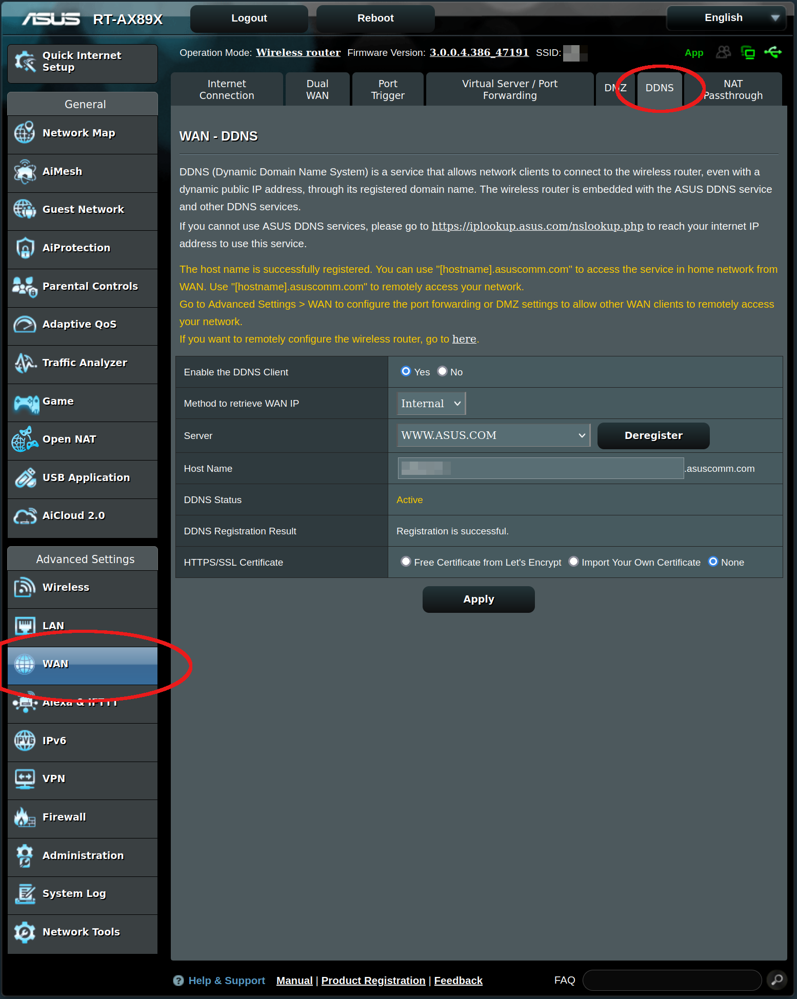

# Introduction

This is a presentation for [CUCUG](https://cucug.org) on using an ASUS
router for setting it up as a personal OpenVPN server.

There are two common use cases for having a personal VPN server:

  - You don't trust the ISP or Wifi you're using while away from
    home and want all your Internet traffic and DNS lookups encrypted
    and invisible to them, and/or
  - You want to be able to access your home network remotely as if
    you were at home.

# Preparation

## ISP modem and ASUS router

Obviously, the two things you'll need first is an internet
connection and an ASUS router that supports being a VPN server.
Most of the newer ASUS routers that aren't bottom-of-the-line have a
VPN server service built-in by default.

You'll want to have your ISP's modem configured for "IP passthrough"
(it may be called other things in different modems).  In this mode,
the modem only connects to the router providing it with a real IP
address and passing all traffic through to it unchanged.

When you have completed this step, going to your
[router's GUI interface Network map](https://www.asus.com/support/FAQ/1005263)
will show a routable WAN IP address, not one starting with `10.x.y.z` or
`192.168.x.y`.

## Dynamic DNS

If your ISP assigns your modem's IP address dynamically (meaning it
can change at any time), you'll want to configure for DDNS giving it
an DNS resolved host name with the automatically updated IP.  For
ASUS routers, this is a
[free service provided by ASUS.](https://www.asus.com/support/FAQ/1011725/).

You can see what my ASUS router's page looks like once configured:

The reason for setting up DDNS is that without a DDNS name, the
OpenVPN configuration files given to clients will embed your
router's current IP address.  When your modem is assigned a new IP
address by your ISP, you'll have to hand out a new OVPN config file
to all your clients.

# Setting up OpenVPN on an ASUS router

Configuring OpenVPN on my ASUS router was more straight-forward than
I expected.  Just click on the `VPN` sidebar, select the `VPN Server`
tab, click on the `OpenVPN` button, and then enable the service.  Your
screen once active will look something like mine:

.

Note that you may not see or be able to access the the menu items
below until you add a new Username and Password, so let's do that
first by scrolling down the page to create yourself a Username and
Password.  After entering a username and password, click on the
circled "+" sign to add it then click "Apply".

Now back to the top.  You'll want to set a `Server Port`.  I used
1194 as the default for OpenVPN.

Set `RSA Encryption` to 2048 bit.  1024 is just too low for good
security, but it might be worth it if giving up some security for
better performance.

Set `Client will use VPN to access` depending on your reason for the
VPN service.  If you trust the ISP you're using remotely, you can
leave this as `Local network only`, but if you don't, you'll want
to use `Internet and local network`, so all your traffic and DNS
lookups stay encrypted between your remote machine and your network.

Now you can click the `Export` button to generate and download a
`client.ovpn` file for your clients' use.

Access to your home network is two-factor.  Someone has to have both
your `client.ovpn` file and a matching Username and Password, so
protect both of them!

Now you're completely done with your router and ready for clients.

# Configuring Clients for OpenVPN

## iPad or iPhone

On my iPad and iPhone, I downloaded the `OpenVPN Connect` app.

I uploaded my `client.ovpn` file using my iCloud account, then
accessed it on my iPad and iPhone devices to import the file.

On the iPhone using iCloud's `Files`, I just double-clicked on the
file.  On the iPad, I had to "open" the file, then tap the box the
up arrow then select `OpenVPN` from the list of apps.

To connect and disconnect, just run the `OpenVPN Connect` app to
enable and disconnect at will.  When enabled, `VPN` with a box
around it will appear in your device's status bar.

## MacOS

On MacOS from the App Store, I downloaded `Passepartout`.  I
then ran iCloud's `Files` and double-clicked on the `client.ovpn` 
file.  This passed the file to `Passepartout`.

You'll be prompted for the Username and Password you had previously
set up with your ASUS router for use with OpenVPN.

The VPN connection can be enabled or disconnected by using the
`Passepartout` icon in the menu bar.  When connected or disconnected
from the VPN, the `Passepartout` menu bar icon changes appearance.

I had tried the `OpenVPN Connect` client software downloaded directly
from the [OpenVPN Community](https://openvpn.net/vpn-client/) site.
However, at least running under Big Sur for me, it had problems
tearing down the VPN and restoring normal networking where
`Passepartout` did not.

## Linux

You'll need to install an OpenVPN client package on your system.
On Fedora, RHEL, or RHEL-like, you'll find an `openvpn` package.
Install with:

    $ sudo dnf install -y openvpn

For Ubuntu or derivatives, install with:

    $ sudo apt install openvpn

The `client.ovpn` file you earlier downloaded with your browser from
your ASUS router can now be copied over to your Linux host(s) under
`/etc/openvpn/client/`.  I renamed my file to `clientudp.conf`.

You can now start the service with:

    $ sudo systemctl start openvpn-client@clientudp.service

To check status, run:

    $ sudo systemctl status openvpn-client@clientudp.service

If you're on a distro with SELinux, you may have to run:

    $ sudo chcon -t openvpn_etc_t /etc/openvpn/client/clientudp.conf

to make sure the file has the right security context.

To enable the service when your machine starts, run:

    $ sudo systemctl enable --now openvpn-client@clientudp.service

Each time you start the service, you'll need to login with the
Username and Password you had previously set up with your ASUS
router for use with OpenVPN.

# Windows

You can download and install the `VPN Connect` client software directly
from the [OpenVPN Community](https://openvpn.net/vpn-client/) site.

It worked fine for me when configured with my `client.ovpn` file.

# Conclusions

I found setting up and using OpenVPN on both my ASUS router and on
the Mac, iPad, iPhone, and Linux systems far simpler and easier than
I had imagined.  Kudos for the ASUS and OpenVPN folks!

I did notice though that throughput performance on the VPN was
so-so.  It was still good enough for video streaming and basic
work, but it was a choke point.  I'd still recommend
[Wireguard](https://www.wireguard.com/) over OpenVPN for those with
the know-how and performance-sensitive workloads.
